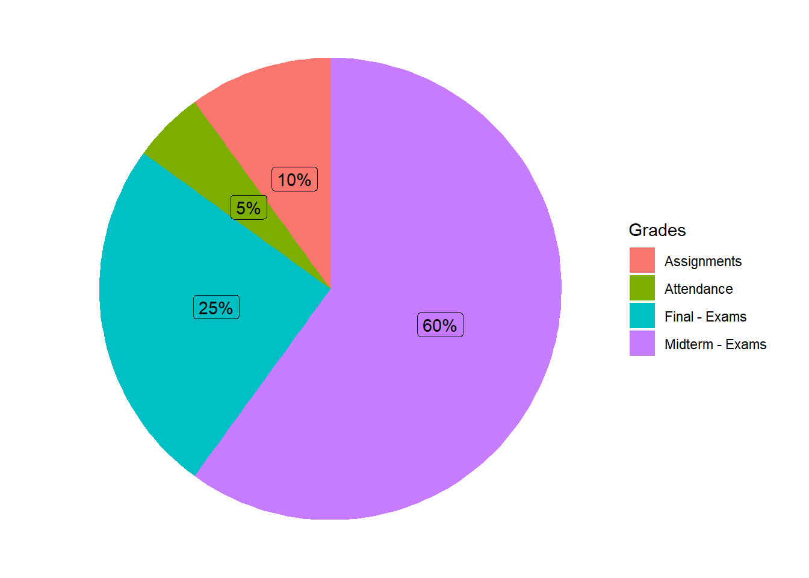
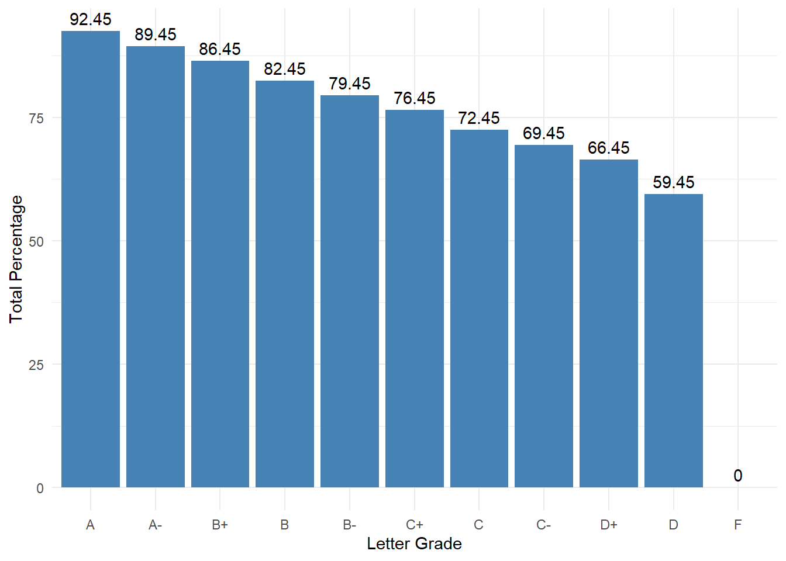

## Office hours

Office: 3537 Unistructure

MTh: 10:15pm-12:45pm or by appointment

[Zoom's Link](https://bryant.zoom.us/j/4419675207)

## Course Description

This course is a continuation of MATH 121, designed for Actuarial Mathematics, Applied Math and Statistics, Applied Economics, Biology and Environmental Science majors, and those concentrating in Applied Statistics. It is recommended for the math minors also. Topics include L'Hopital's Rule, the calculus involving inverse trigonometric functions, integration methods, modeling with differential equations, geometric series, MacLaurin and Taylor Polynomials and Series, introduction to partial derivatives and multiple integrals.

These courses will provide part of the material necessary to prepare for the first professional actuarial exam (Exam P - Probability).

## Textbook and Learning Materials

Calculus: Late Transcendental, by Howard Anton, Irl C. Bivens, Stephen Davis.

## Course Objectives

The primary goals of this course are to provide the student with the capabilities to understand problems in differential and integral calculus and apply the appropriate methods to solve them. After taking this course, the student should be able to do such things as:

-   find lengths of plane curves
    -   use L’Hopital’s rule
    -   use different methods of integration (by parts, trigonometric substitution, etc.)
    -   understand elementary first-order separable differential equations
    -   understand sequences
    -   determine whether series diverge or converge
-   determine sums of infinite series

## Grades Distribution

::: {.cell}
::: {.cell-output-display}
{width=672}
:::
:::

-   **Exams:** The course consists of four exams: three midterms and a final. A dedicated review session will be held prior to each exam.

-   **Homework Assignments:** Assignments are due every Monday and must be submitted on Canvas by uploading clear photos of your work. Consistent practice through these assignments is the most effective way to master the material and prepare for exams.

-   **Attendance:** Regular attendance is essential for success in this course and will be recorded at every class session. Students with no more than two absences will receive full attendance credit (5% of the final grade). If you have a university-excused absence, notify me in advance to ensure it does not impact your grade.

## Grades Scale

The numerical grades are converted to letter grades as follows.

|     |                |     |                |
|-----|----------------|-----|----------------|
| A   | 92.45 - 100%   | C   | 72.45 - 76.44% |
| A-  | 89.45 - 92.44% | C-  | 69.45 - 72.44% |
| B+  | 86.45 - 89.44% | D+  | 66.45 - 69.44% |
| B   | 82.45 - 86.44% | D   | 59.45 - 66.44% |
| B-  | 79.45 - 82.44% | F   | Below 59.44%   |
| C+  | 76.45 - 79.44% |     |                |

::: {.cell}
::: {.cell-output-display}
{width=672}
:::
:::

## Tentative Topics

| Unit / Chapter                                                                                 | Section | Topic                                          |
|:-----------------------|:-----------------------|:-----------------------|
| **I. Applications of the Definite Integral** *(Chapter 5)*                                  | 5.4     | Length of a Plane Curve                        |
| **II. Exponential, Logarithmic, Inverse Trigonometric Functions** *(Chapter 6)*             | 6.5     | L’Hopital’s Rule; Indeterminate Forms          |
|                                                                                                | 6.7     | Inverse Trigonometric Functions                |
| **III. Principles of Integral Evaluation** *(Chapter 7)*                                    | 7.1     | An Overview of Integration Methods             |
|                                                                                                | 7.2     | Integration by Parts                           |
|                                                                                                | 7.3     | Integrating Trigonometric Functions            |
|                                                                                                | 7.4     | Trigonometric Substitutions                    |
|                                                                                                | 7.5     | Rational Functions – Partial Fractions         |
|                                                                                                | 7.8     | Improper Integrals                             |
| **IV. Mathematical Modeling with Differential Equations** *(Chapter 8 — depending on time)* | 8.1     | Modeling With Differential Equations           |
|                                                                                                | 8.2     | Separation of Variables                        |
| **V. Infinite Series** *(Chapter 9)*                                                        | 9.1     | Sequences                                      |
|                                                                                                | 9.2     | Monotone Sequences                             |
|                                                                                                | 9.3     | Infinite Series                                |
|                                                                                                | 9.4     | Convergence Tests                              |
|                                                                                                | 9.5     | The Comparison, Ratio, and Root Tests          |
|                                                                                                | 9.6     | Alternating Series; Abs. and Cond. Convergence |
|                                                                                                | 9.7     | Maclaurin and Taylor Polynomial                |
|                                                                                                | 9.8     | Maclaurin and Taylor Series; Power Series      |
|                                                                                                | 9.9     | Convergence of Taylor Series                   |
|                                                                                                | 9.10    | Differentiating and Integrating Power Series   |

> **Prerequisite Note:** Derivatives and Integrals of Exponential and Logarithmic Functions (Sections 6.2 and 6.3) are covered in detail in M121.

## Academic Misconduct

A student’s education is the result of individual initiative and industry. A student indisposed to such an academic commitment will not gain an education at Bryant University. Each Bryant student, accordingly, understands that to submit work that is not his or her own is not only a transgression of University policy but a violation of personal integrity. A high standard of conduct in academic experiences is expected of each student.

The academic community, therefore, does not tolerate any form of “cheating” – the dishonest use of assistance in the preparation of outside or in-class assignments. Such violations, which include forms of plagiarism, are subject to disciplinary action.

To preserve its commitment to the high standards of intellectual and professional behavior, Bryant University rewards intellectual excellence and expects intellectual honesty.

Academic dishonesty includes but is not limited to:

-   plagiarism in any form;
-   using an illegal cheat sheet during a quiz or examination;
-   copying from another student's examination, term paper, or lab report;
-   intentionally missing (or delaying taking) an exam to gain an unfair advantage;
-   submitting the same paper or report in more than one course without permission of the instructors;
-   falsification or invention of data;
-   unauthorized access to or the use of the computerized work of others;
-   obtaining questions for an examination from another student who had already taken it;
-   obtaining answers for an examination from another student who had already taken it;
-   misappropriation of examination materials or information;
-   changing a response after a paper, examination, or quiz is graded, then reporting a misgrade and asking for credit for the altered response;
-   taking an examination for another student;
-   giving illicit aid on exams, papers, or projects.

Lack of knowledge of the above is unacceptable as an excuse for dishonest efforts. Any form of cheating could result in failure of a test, failure of the course, or some other disciplinary action.

## Regarding Diversity

In this course, and all your courses at Bryant, and throughout the Bryant learning community, we value and respect diversity. This includes differences in race, ethnicity, nationality, gender, gender identity, sexuality, socioeconomic status, ability, and religion.
